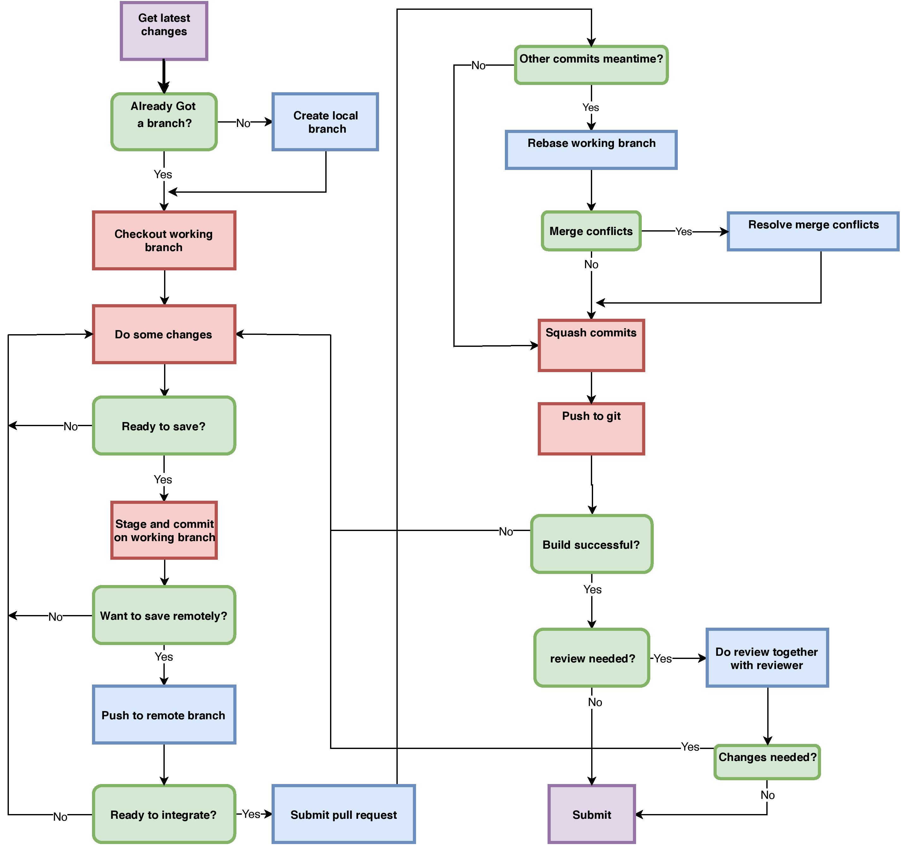

# Knowledge Traceability in Higher Education

This is part of a [project course](https://www.ltu.se/edu/course/D00/D0020E/D0020E-Projekt-i-datateknik-1.112677?kursView=kursplan&l=en) in Computer Science for students in their third year.
The course's aims are to develop the students knowledge and understanding by
- Demonstrating knowledge and ability to work with software engineering both individually and in a group 
- Demonstrating knowledge and understanding of proven software engineering methods and theories
- Demonstrating insight in how the industry work with software engineering 
- Demonstraing knowledge within the following areas of software engineering: 
	- System analysis through requirement engineering
	- Modeling in UML (Unified Modelling Language)
	- Modeling using patterns
	- Iterative and light-weight system design (Evolutionary Design)
	- Roles, equal opportunities, and gender in software engineering 

## The project
The project is to develop a tool that enable students, teachers, education advisors and admission officers to understand the relation between courses and their associated knowledge components and students' mastery of the latter.
For example, a student should easily be able to understand where a challenging topic will be used in later classes.
Or, a teacher can insure that a prerequisite for a course is reasonable and that it was covered to a desired competence level within a reasonable time for recollection.

## The group
Within the course, the student group (Group 2) is composed of 6 students.

[Collaborators](../master/people/)

## The Git Workflow
All group members are collaborators on the remote repository.
The master branch is locked so that accidental unreviewed changes are not possible.
Each member push their committed changes to their own branch before making a pull request.




Message should be short and on point, 'feature: what i have done for this commit'
 f
## Git Instructions
#### Repo setup
##### Prerequisites:

1. [Git-for-windows](https://git-scm.com/ "Git Homepage")

##### Setup:

```bash
git clone https://github.com/Github-username/d0020e.git
```

#### Git branches


```bash
git switch -c NEW_BRANCH_NAME
```
to change to a branch that already exist 

```bash
git switch BRANCH_NAME
```
#### Git pull
gets the latest version


#### Git push and commit
Before commit check status
```bash
git status
```
To add all item (or specific files) 
```bash
git add .
```
**Make sure you are not on master branch**
commit changes
```bash
git commit -m 'message'
```
and to push changes (will not appear in repo before push) always stage a commit before pushing
```bash
git push
```
Finally when branch is done, submit a pull request on Github.
If you are on a new branch sometimes you are required to push up stream

```bash
git push --set-upstream origin BRANCH_NAME
```
Alternatively and much more simple:

```bash
git push -u origin BRANCH_NAME
```
#### Git documentation

[Gitlab-documentation](https://docs.gitlab.com/)

#### Git Markdown

* [Github-markdown](https://guides.github.com/features/mastering-markdown/)

* [Gitlab-markdown](https://docs.gitlab.com/ee/user/markdown.html)
